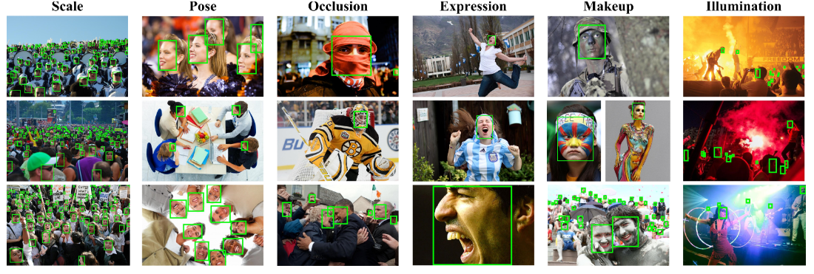
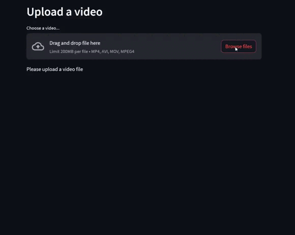

## [Face detection model](https://github.com/yahyoxonqwe/yolo_face_detection) deploy localhost and global(with [ngrok](https://ngrok.com/)) with [streamlit](https://github.com/streamlit/streamlit)

This repository contains deploy of [NVIDIA TensorRT](https://github.com/NVIDIA/TensorRT) model . 



# Installation
Clone the repository:
``` bash
git clone https://github.com/yahyoxonqwe/tensorRt-deploy-global-with-streamlit.git
```
Change into the project directory:
``` bash
cd tensorRt-deploy-global-with-streamlit
```
Install the required dependencies:
``` bash
pip install -r requirements.txt
```
Set your ngrok token : 
``` bash
ngrok config add-authtoken your_auth_token
```
## Deploy localhost and global (with ngrok)
``` bash
streamlit run stream.py --server.port 8666 & ngrok http 8666
```

### time.sleep is used to buffer images due to slow internet speed




